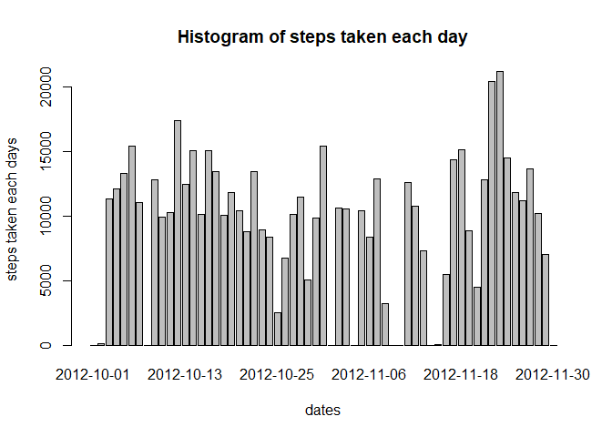
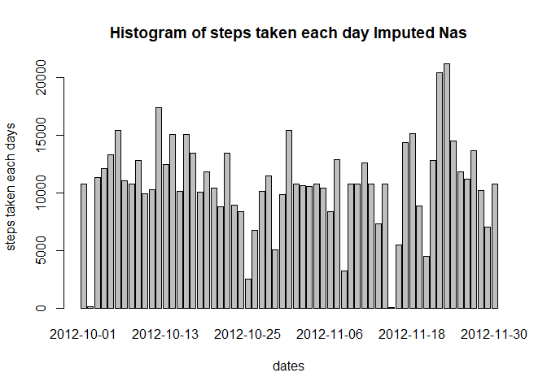
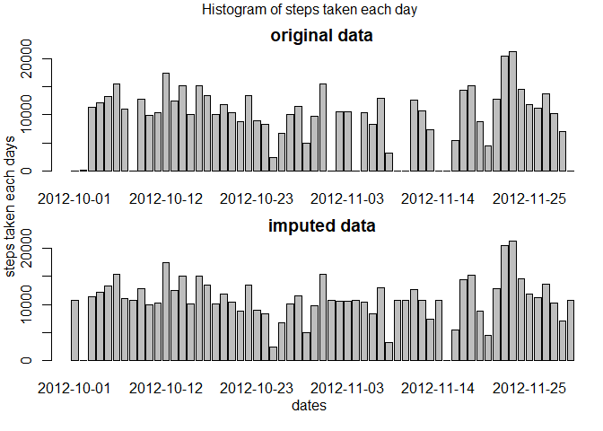
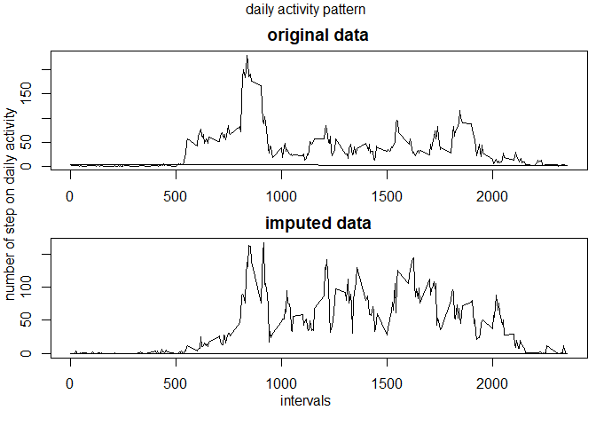

## Loading and preprocessing the data

```r
activity<-read.csv("activity.csv", header=T)
activity <- transform(activity, date = as.Date(date,"%Y-%m-%d"))
head(activity)
```

```
##   steps       date interval
## 1    NA 2012-10-01        0
## 2    NA 2012-10-01        5
## 3    NA 2012-10-01       10
## 4    NA 2012-10-01       15
## 5    NA 2012-10-01       20
## 6    NA 2012-10-01       25
```
## What is mean total number of steps taken per day?

Calculate the sum of step taken each day


```r
stepDays<-tapply(activity$steps, activity$date, sum, na.rm=T)
```

Histogram of steps taken each day


```r
barplot(as.numeric(stepDays), names=unique(activity$date), ylab="steps taken each days", xlab="dates", main="Histogram of steps taken each day")
```

<!-- -->

Calculate mean and median of steps taken per day


```r
mean<-mean(stepDays, na.rm=T)
median<-median(stepDays, na.rm=T)
```

the mean total number of steps taken each day is 9354.2295082  
the median total number of steps taken each day is 10395

## What is the average daily activity pattern?
calculate the mean of 5 minute interval across all day

```r
dailyActivity<-tapply(activity$steps, activity$interval, mean, na.rm=T)
maxDaily<- names(which.max(dailyActivity))
```

time series of activity pattern


```r
plot(names(dailyActivity), dailyActivity, type="l", xlab="Interval", ylab="number of step on daily activity", main="daily activity pattern")
```

<!-- -->

The 5 minute interval that contain the maximum is on 835 interval

## Imputing missing values
Calculating number of Nas in the data

```r
countNa<-sum(is.na(activity$steps))
```

There are 2304 Nas in the data

To impute Nas would be reasonable to fill it with the average steps in averaged interval 


```r
activityImputed<-activity #making newdataset
activity$mean.interval<-ave(activity$steps, activity$interval, FUN=function(X) mean(X, na.rm=T))# assign new column of interval mean to each observation
for (i in 1:length(activity$steps)){
        if (is.na(activityImputed$step[i])){
                activityImputed$steps[i]<-activity$mean.interval[i]}
}# imputing each Na with the 5 minute interval average
head(activityImputed)
```

```
##       steps       date interval
## 1 1.7169811 2012-10-01        0
## 2 0.3396226 2012-10-01        5
## 3 0.1320755 2012-10-01       10
## 4 0.1509434 2012-10-01       15
## 5 0.0754717 2012-10-01       20
## 6 2.0943396 2012-10-01       25
```

Calculate the sum of step taken each day in imputed data


```r
stepDaysImputed<-tapply(activityImputed$steps, activity$date, sum, na.rm=T)
```

Histogram of steps taken each day in imputed data


```r
barplot(as.numeric(stepDaysImputed), names=unique(activity$date), ylab="steps taken each days", xlab="dates", main="Histogram of steps taken each day Imputed Nas")
```

<!-- -->

Calculate mean and median of steps taken per day in imputed data


```r
meanImputed<-mean(stepDaysImputed)
medianImputed<-median(stepDaysImputed)
```

the mean total number of steps taken each day in Imputed data is 1.0766189\times 10^{4} and in the original data is 9354.2295082  
the median total number of steps taken each day in Imputed data is 1.0766189\times 10^{4} and in the original data is 10395

Changes on original vs imputed data

```r
par(mfrow=c(2,1), oma=c(2,1,1,0), mar=c(2,2,2,0.5))
barplot(as.numeric(stepDays), names=unique(activity$date), main="original data")
barplot(as.numeric(stepDaysImputed), names=unique(activity$date), main="imputed data")
mtext("Histogram of steps taken each day", outer=T)
mtext("steps taken each days", outer=T, side=2)
mtext("dates", outer=T, side=1)
```

<!-- -->

The median aof the data not differ much in original and imputed data as we introduced  NAs, although  mean change, the number of data also increase so the proportion remain the same. for the mean as we pick mean by the daily activity average the mean changes

## Are there differences in activity patterns between weekdays and weekends?

Creating factor consist weekends or weekdays


```r
weekdays <- c('Monday', 'Tuesday', 'Wednesday', 'Thursday', 'Friday')
activityImputed$days.factor <- factor((weekdays(activity$date) %in% weekdays), levels=c(FALSE, TRUE), labels=c('weekend', 'weekday')) 
head(activityImputed)
```

```
##       steps       date interval days.factor
## 1 1.7169811 2012-10-01        0     weekday
## 2 0.3396226 2012-10-01        5     weekday
## 3 0.1320755 2012-10-01       10     weekday
## 4 0.1509434 2012-10-01       15     weekday
## 5 0.0754717 2012-10-01       20     weekday
## 6 2.0943396 2012-10-01       25     weekday
```

calculate the mean of 5 minute interval across all day in Imputed data

```r
dailyActivityWeekdays<-subset(activityImputed, activityImputed$days.factor=="weekday")
dailyActivityWeekdays$mean.interval<-tapply(dailyActivityWeekdays$steps, dailyActivityWeekdays$interval, mean)
head(dailyActivityWeekdays)
```

```
##       steps       date interval days.factor mean.interval
## 1 1.7169811 2012-10-01        0     weekday    2.25115304
## 2 0.3396226 2012-10-01        5     weekday    0.44528302
## 3 0.1320755 2012-10-01       10     weekday    0.17316562
## 4 0.1509434 2012-10-01       15     weekday    0.19790356
## 5 0.0754717 2012-10-01       20     weekday    0.09895178
## 6 2.0943396 2012-10-01       25     weekday    1.59035639
```

```r
dailyActivityWeekends<-subset(activityImputed, activityImputed$days.factor=="weekend")
dailyActivityWeekends$mean.interval<-tapply(dailyActivityWeekends$steps, dailyActivityWeekends$interval, mean)
head(dailyActivityWeekends)
```

```
##      steps       date interval days.factor mean.interval
## 1441     0 2012-10-06        0     weekend   0.214622642
## 1442     0 2012-10-06        5     weekend   0.042452830
## 1443     0 2012-10-06       10     weekend   0.016509434
## 1444     0 2012-10-06       15     weekend   0.018867925
## 1445     0 2012-10-06       20     weekend   0.009433962
## 1446     0 2012-10-06       25     weekend   3.511792453
```

plotting the daily activity on weekend and weekday


```r
par(mfrow=c(2,1), oma=c(2,1,1,0), mar=c(2,2,2,0.5))
plot(dailyActivityWeekdays$interval, dailyActivityWeekdays$mean.interval, type="l", main="original data")
plot(dailyActivityWeekends$interval, dailyActivityWeekends$mean.interval, type="l", main="imputed data")
mtext("daily activity pattern", outer=T)
mtext("number of step on daily activity", outer=T, side=2)
mtext("intervals", outer=T, side=1)
```

<!-- -->
